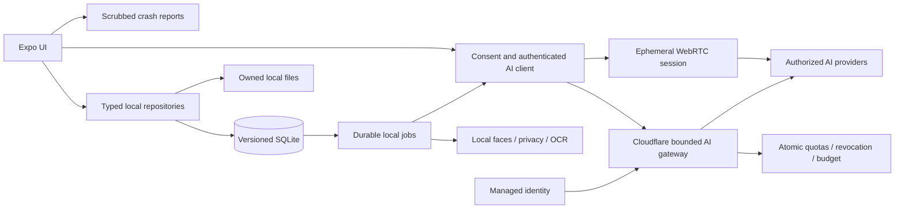

# Recall production engineering roadmap

Audit date: **1 October 2026**. Repository baseline: **`main`, `bf50b30`**. Audience: the engineer responsible for implementation and operating the release.

This is an audit and implementation plan. No application code, dependencies, infrastructure, or provider settings were changed. Proposed files below do not yet exist unless explicitly identified as current files.

## 1. Executive summary

Recall has a substantial working product: local memory capture, task extraction, photo import, People, Places, Timeline, Ask, live voice, documents, and Recap. Its existing local-first design is appropriate for a private memory app. Keep Expo, React Native, the Cloudflare Worker, on-device face recognition, and the separation between guesses and user records.

**The repository is not yet ready for a public production launch.** The most consequential problems are data integrity, privacy checks that fail open, incomplete deletion, unrestricted consumption behind a shared credential, and the absence of repeatable release tests. More screens or a cloud memory database will not fix these.

Recommended direction:

1. Preserve local capture and reading without an account or network connection.
2. Move substantive local records into versioned, transactional SQLite repositories, with stable identities and source relationships. Keep files local and preferences small.
3. Make unfinished processing durable, idempotent, recoverable, and subordinate to the user's work.
4. Block external photo transmission whenever privacy verification or provider-specific consent is uncertain.
5. Keep the Worker as the AI gateway, but replace its unrestricted proxy contract with bounded operations, authenticated principals, quotas, and measured cost controls.
6. Introduce managed identity for public cloud AI access without silently uploading the local diary. For a small invited pilot, individually issued, revocable installation credentials can precede accounts.
7. Establish automated regression checks early; use real iPhones to verify the paths a simulator cannot validate.

**Do not rebuild face clustering, a face-naming workflow, a vector service, Kubernetes, or a cloud copy of every memory as launch prerequisites.** The repository records that the naming workflow was rejected and that the on-device scene-model experiment was evaluated and parked.

Suggested release policy: first a controlled development-device cohort, then a gated TestFlight beta, then a capped public launch. Stop a rollout for any confirmed data loss, unauthorized upload, or material abuse of the AI gateway.

## 2. Current technical state

### 2.1 Evidence and limits

Evidence labels used throughout:

- **Verified — code:** determined from tracked source, configuration, imports, or repository searches.
- **Verified — executed:** a command or an isolated reproduction was run during this audit.
- **Historical:** a claim in `CLAUDE.md`, `HANDOFF.md`, comments, or model notes; not independently remeasured here.
- **Recommendation:** a proposed change or acceptance criterion.
- **Unverified externally:** dashboard, deployed service, installed build, or operational behavior unavailable from the repository alone.

The inspection covered the route tree, shared components and application services, both local Swift modules, the Worker, package manifests and lockfiles, build configuration, model tooling and metadata, working instructions, and recent history. A source inventory scanned **124 application TS/TSX files**. Model binary behavior and UI layout were not validated by reading binaries or counting files.

Commands/checks performed:

| Check | Result | Interpretation |
|---|---|---|
| `git status --short --branch` | Clean `main...origin/main` at audit start | No pending work was folded into this audit. Remote tracking status is local information, not a fresh fetch. |
| `./node_modules/.bin/tsc --noEmit` | Exit 0, no diagnostics | Root strict TypeScript compilation passes; not a runtime or bundle test. |
| `./node_modules/.bin/tsc --noEmit -p server/tsconfig.json` | Exit 0, no diagnostics | Worker type check passes. |
| `CI=1 ./node_modules/.bin/expo install --check` | “Dependencies are up to date” | Used the installed SDK's local dependency map; command explicitly warned that offline validation is unreliable. No remote Expo compatibility verdict. |
| Root `npm audit --json --ignore-scripts` | 17 affected package entries: 16 moderate, 1 high | Includes transitive/metavulnerability entries, not 17 independently exploitable production flaws. |
| Worker `npm audit --json --ignore-scripts` | 3 affected package entries: 2 moderate, 1 high | Worker manifest dependencies are development tooling; this does not establish a deployed Worker runtime vulnerability. |
| Installed tools | Node `v22.23.2`, npm `10.9.8` | Local toolchain evidence only. |

The initial npm registry requests failed in the sandbox. Read-only retries with network access succeeded. No `npm audit fix`, package installation, native build, deployment, live AI call, or user-data upload was performed.

Isolated reproductions transpiled the **existing functions in memory**, with fake storage/provider modules and stubbed upstream fetches. No source files were edited and no provider was contacted:

```text
Concurrent memory saves: { attempted: 2, persisted: 1 }
Non-JSON content-type allowlist check: { response: 200, upstreamCalls: 1 }
Body limit without Content-Length: { bytes: 26214448, response: 200, upstreamCalls: 2 }
Intake task-write failure: { returned: false, storedRefined: true, storedRawText: true }
Upload filter, missing native module with known sensitive photo: { returned: 1 }
Upload filter, preview missing: { returned: 1, markedChecked: true }
Empty-profile Ask context contains demo place: true
```

These establish behavior of the current JS/Worker logic. They do not substitute for a native-device test, deployed-edge test, or a saved automated regression suite.

Unverified externally: actual Worker deployment revision and secrets, provider/model availability and retention settings, spend caps, Cloudflare account limits, EAS environment values and signing, App Store Connect configuration, Sentry ingestion/symbolication/retention, iCloud backup restoration, and installed iOS behavior. `CLAUDE.md` records some successful historical device tests; preserve that evidence but repeat launch-critical checks on the release candidate.

### 2.2 Architecture and stack

**Verified — code:** this is a mobile client with a small AI proxy, not a server-backed productivity database.

| Layer | Current implementation | Readiness classification |
|---|---|---|
| Application | Expo `~57.0.25`, React Native `0.86.3`, React `19.2.3`, TypeScript `~6.0.3`; entry `expo-router/entry` | Functional; needs release-device validation. |
| Navigation/UI | `app/` file routes; four tabs in `app/(tabs)/_layout.tsx`; pushed screens; `src/components/AppNav.tsx` overlays matching navigation on selected screens | Functional; duplicated navigation definitions and fixed 84px height need tests/refactoring. |
| Design | `src/theme.ts`, `src/images.ts`, Poppins fonts, Expo icons, React Native styles, Reanimated/worklets, Skia | Functional; sparse accessibility semantics and large screen modules. |
| Backend | Single Cloudflare Worker in `server/src/index.ts`; Wrangler `^4.0.0`; Workers types; separate TypeScript config | Functional prototype gateway; public security/cost blockers. |
| State | Screen-local `useState`/refs/effects, `useFocusEffect` re-fetches, module-level caches, flags, listeners and Promise chains | Functional; no unified repository/subscription boundary or durable job coordinator. |
| Data | AsyncStorage JSON records for almost all app data; `expo-sqlite` only for faces | Functional at current size; integrity/migration risks. |
| Native capabilities | Apple-only `modules/photo-guard` and `modules/text-reader`; TFLite/CoreML face inference; WebRTC audio | Functional on the documented iPhone workflow; Android parity is incomplete. |
| Backend persistence | None configured; no D1/KV/R2/Durable Object bindings in `server/wrangler.jsonc` | Missing for per-principal quotas, revocation and usage controls. |
| Identity | Local `UserProfile`; shared `RECALL_APP_TOKEN` at the Worker | Profile is not authentication. User accounts/session lifecycle are missing. |
| Delivery | Local Xcode development-build workflow; EAS development/preview/production build profiles; Wrangler deploy script | Partially configured; no tracked CI/CD or staging Worker. |
| Telemetry | Sentry hooks and DSNs in EAS preview/production; Worker observability enabled; console logs | Useful baseline; ingestion, scrubbing, release attribution and alerting unverified. No product analytics integration found. |

Startup in `app/_layout.tsx` independently starts photo analysis, Places indexing, library/privacy sync and recovery/import, face-model installation/indexing, recap notification reconciliation, and Sentry. These are **jobs running in the app process**, not an OS background-task system. No `expo-background-task`/TaskManager registration was found.

Major dependency groups, as declared in `package.json`:

- Storage/media: AsyncStorage `2.2.0`; SDK 57 SQLite, FileSystem, MediaLibrary, Image/ImageManipulator, Audio, pickers and Notifications. Some current call sites explicitly use legacy FileSystem/MediaLibrary APIs; replace only after checking SDK 57 behavior and reproducing the existing device fixes.
- Native inference/rendering: `react-native-fast-tflite ^3.0.1`, Nitro Modules `^0.37.1`, Skia `2.6.2`; bundled BlazeFace/FaceNet assets plus the custom CoreML privacy module. These require compatible native builds and model provenance, not just JS compilation.
- Voice: `react-native-webrtc ^124.0.8` with config plugin `^15.0.2`, Expo Audio and Speech. There is no provider SDK: application/Worker code constructs HTTP requests directly.
- UI/runtime: Router `~57.0.23`, Reanimated `4.5.1`, Worklets `0.10.1`, Gesture Handler, Screens, Safe Area Context, SVG and Poppins fonts.
- Observability/tooling: Sentry React Native `~7.11.0`; root TypeScript `~6.0.3`; Worker declares TypeScript `^5.9.2`, Wrangler `^4.0.0` and Workers types. Neither manifest declares a test framework. The manifests' ranges are not a substitute for the exact lockfile versions used by CI.

### 2.3 Data models and storage inventory

| Domain | Model and persistence | Integrity/ownership observations |
|---|---|---|
| Memories | `LoggedMemory`, `Attachment`, transcript words; `src/memoryLog.ts`; key `loggedMemories` | One entire JSON array. IDs use timestamp/random strings. `takenAt` falls back to `createdAt` for older entries. No transaction or schema version. |
| Tasks | `StoredTask`; `src/tasks.ts`; `storedTasks` | Entire JSON array. Manual and AI tasks share the store. AI dedup uses title + source day, not extraction/source identity. Only document-created tasks consistently carry `memoryId`. |
| People | `PersonMeta`, day-tag maps; `src/peopleTags.ts`; `personMeta`, `dayPeople`, `notDuplicatePeople` | Display names act as primary keys; aliases and manual merge exist. Notes/tagging can outlive deleted source memories. |
| New face guesses | `Guess`; `src/guessedPeople.ts`; `dayPeopleGuesses`, `dayPeopleRejected` | Kept separate from confirmed tags; confirmation/rejection functions exist. No stable source-person relation or merge/delete migration across these records. |
| Older suggestions | `PersonSuggestion`; `src/personSuggestions.ts`; `personSuggestions`, `personScannedDays` | Parallel legacy suggestion mechanism still imported by screens and rename helpers. |
| Places | `Place`, `DayEntry`; `src/places.ts`; `places`, `dayPlaces`, `geocodeCache` | Stable place IDs, spatial grouping at 70m, named aliases, visit/cover derivation. A Promise lock serializes much of Places, but writes across keys are not atomic. |
| Photo metadata | `PhotoMeta`; `src/photoMeta.ts`; `photoMeta` keyed by URI | Timestamps, device asset/cloud IDs, location, classification, provenance, place linkage. Shared mutable in-memory object and whole-record writes. |
| Import bookkeeping | `src/photoImport.ts`; `importedPhotoAssetIds`, `photoSyncOn`, backfill/recovery flags | Ad hoc versioned flags; no unified import transaction, cursor/job model, or ownership/tombstone schema. |
| Face database | `recall-faces.db`; `src/faceIndex.ts`; `faces`, `face_meta`, `read_photos`, `person_faces` | WAL, parameterized queries, indexes, per-photo transactions. Embeddings packed from Float32 into base64 text; current embedder is 512-dimensional despite stale 192-dimension comments. No numbered schema migration. |
| Day icons | `DayMarker`, `RecurringMarker`; `src/dayMarkers.ts`; `dayMarkers`, `recurringMarkers` | Some day markers carry `memoryId`; recurring entries have person names and recurrence rules, but not complete source provenance. |
| Conversations | `ChatMessage`, `ChatSessionMeta`; `src/chatSessions.ts`; `chatSessions`, `chatSession:<id>` | Separate message blobs/index; writes and deletes span keys without transactions. Live and typed conversations share this history. |
| AI-derived content | `AssumedMemory` in `assumedMemory:<day>`, dismissal map; `RecapLine` in `recap:*` | Cached separately from originals; prompt/input signatures exist. No centralized retention, dependency invalidation, or deletion ledger. |
| Public/event content | `src/onThisDay.ts` (`otdFeed-*`, `otdEvents-*`, topic overrides/interests); `src/worldEvents.ts` (`worldEvent:*`) | Cache-first but successful relative event queries can remain cached indefinitely; citations are not preserved end-to-end. |
| Profile/settings | `userProfile`, `onboardingComplete`, `quizAnswers`, `photoReading`, chosen days, recap preferences | Local identity/settings. The quiz's first answer drives interests; other promises need alignment with actual settings. |
| Durable files | `persistFile()` in Documents: recordings, manually selected images, avatars, attachments/previews/crops | `localFile()` rebases owned flat paths after container changes. Copy errors fall back to the original potentially temporary URI. No central file inventory/garbage collection. |
| Temporary files | Image-manipulator output, TTS files in Caches, pickers/recorders, decoded photos | Appropriate for derived transient output; no verified cleanup/bounded cache lifecycle. |

There is no remote memory database, bidirectional cloud synchronization, vector database, or first-party content-object storage configured. iCloud Backup is the **documented recovery strategy**, not an implemented application-level sync service or a restoration guarantee.

### 2.4 Functional flows and external services

| Flow | Actual modules/functions | Current behavior and gaps |
|---|---|---|
| Capture/intake | `app/log/{text,voice,photo,attachment}.tsx`; `saveMemory()`, `processMemoryIntake()`, `analyzeMemory()` | Original capture precedes best-effort AI. Intake polishes and routes tasks, people, places, icons, repeats. `refined` is set before downstream writes; failure can permanently omit results. Relative dates use processing-day `new Date()`, even for historical entries/retries. |
| Pending transcription | `transcribeAudio()`, `transcribePendingMemories()`, `useMemoryPolish()` | Native multipart upload; quota/rate distinctions; local retry counters. The 90s Promise race does not cancel upload. Network/timeout failures can count toward four permanent failures. Multiple screen sweeps can overlap transcription. |
| Photo import | `importRecentPhotos()`, `backfillPhotoMeta()`, `fileDayPhotos()` | 100-asset pages; six concurrent info reads; iCloud originals avoided during bulk import. Metadata then memories then imported IDs, but no atomic commit/global import lock. Recovery can run a year import independently of `photoSyncOn`. |
| Photo display/restore | `PhotoImage`, `displayUriFor()`, `resolvePhotoUri()`, `localFile()` | Important device-specific path repairs exist. `ph://` display directly returns the stored ID before checking remapped metadata; restore behavior needs tests for both URI forms. |
| Library deletion/privacy | `syncPhotosWithLibrary()`, `removePhotos()`, `onlyCheckedPhotos()` | Full-access guard, cloud-ID remapping, hidden-asset awareness, cascade to faces/guesses/day story/cover. Large-loss guard is **both** >25 missing and >20%, not simply “never remove >20%.” Unknown checks can be stored as passed. |
| Recognition | `installFaceEmbedder()`, `runIndexingPass()`, `noticePeople()` | BlazeFace full-range + FaceNet-512; crop 0.4, RGB/unit scaling, no alignment; quality gates 90px/0.75; matching 0.58 for People. TFLite runs serialized. Errors/failed decode can still become permanent zero-face reads. |
| Places | `recordNamedPlaceForDay()`, `startPlaceIndexing()`, `toLocation()`, `streetLabel()` | On-device GPS grouping and user-owned covers; reverse geocoding sends coordinates through the platform geocoder. Place names/visits enter Ask/voice text. “Places never leave the phone” is therefore too broad. |
| Documents | `saveAttachmentMemory()`; Swift Vision/PDFKit | Document bytes stay local on the normal intake path; OCR words are transmitted to intake. PDF reads default to 10 pages and intake truncates to 6,000 characters; no complete extraction status is persisted. |
| Typed Ask | `askMemory()`, `planQuery()`, `buildMemoryContext()` | Date/event/keyword retrieval, compact fallback, references and sources, recent history, provider retries. Context also injects `data.ts` demo `PLACES`. Sources/reference names are not verified against the actual retrieved evidence. |
| Live voice | `startLiveVoice()`, `runRealtimeTool()`, `app/live.tsx` | Worker mints a short-lived OpenAI secret; WebRTC goes directly to OpenAI; lookup tools run locally and their outputs travel to OpenAI. **Seven advertised tools**, plus a `days_with_person` dispatcher handler; older docs say six. Client-only ten-minute timer; incomplete connection/error/cancellation handling. |
| Speech output | `speakText()` in `src/speech.ts` | Worker TTS, cached audio; device speech fallback. Model string is duplicated rather than using `MODELS`; request cancellation/late playback and cache cleanup need work. |
| Recap | `recapPeriod()`, `recapLine()`, `RecapView`, `RecapOverview` | Week/month/year units; Today uses local content. Cache signatures, offline verbatim fallback, mixed guess inputs. Model can say `guessed:false` with mixed evidence and evade the label. |
| Notifications | `scheduleTaskReminder()`, `scheduleEarlyReminders()`, `syncRecapNotifications()` | Local scheduling only; task reminders carry task titles on the lock screen. Recap schedules claim readiness although writing occurs on open. Only recap responses are routed by the root notification handler. |
| Public event feed | `getDayFeed()`, `getTopicEvents()`, `resolveUnknownEvents()` | OpenAI web search, then on-device article fetch for Open Graph images. Date-independent canned fallback news appears under selected dates. `withImages()` removes the source URL; web event dates lack persisted citations. |
| Hardware | `app/devices/*`, Profile device row | Static “connected,” battery 88%, 42 scenes, 18 events; Add actions have no implementation. No device SDK/transport was found. Remove claims before release. |

AI model strings below are **verified configuration**, not a fresh capability/pricing verification: DeepSeek `deepseek-v4-flash` and experimental `deepseek-v4-flash-vision-exp`; OpenAI `gpt-4o-mini`, `gpt-5-search-api`, `gpt-transcribe`, `gpt-4o-mini-tts`, `gpt-realtime-2.1`, and `gpt-live-transcribe`. `src/aiProviders.ts` centralizes most selection; search/TTS/realtime still contain hardcoded names. Text and vision automatically fall back to OpenAI. A photo consent screen that names only DeepSeek does not describe that fallback.

The Worker forwards four ordinary operations plus `/realtime/token`. No provider key was observed in the current client configuration/source. `.env`/`.dev.vars` are ignored. Historical bundle/key-history claims were not rechecked. Public variables are extractable; the Sentry DSN is public configuration, not a provider secret.

### 2.5 Security, privacy, configuration and deployment

**Good mechanisms already implemented:** HTTPS provider endpoints; server-held provider secrets; an authentication check; POST/path restrictions; a model allowlist for JSON requests; short-lived realtime credentials; a photo-reading choice defaulting to no transmission until answered; local face inference and OCR; sensitive-photo exclusion; confirmed/guessed stores; full-photo-access deletion safeguards; Sentry suppression of console breadcrumbs/user/request data, screenshots and replay.

**Missing or incomplete:** authenticated individual sessions; secure credential persistence/rotation; per-principal entitlement and request/spend controls; enforced body/response/output bounds; endpoint-specific schemas/models; upstream deadlines; central redaction; provider-specific consent for all transmitted data classes; delete-all/export/account deletion; trustworthy dependency provenance and migrations; reproducible automated tests; complete staging/production separation; incident response and recovery exercises.

`server/src/index.ts` checks only the caller's `Content-Length`; JSON parsing/allowlisting happens only when the supplied Content-Type includes `application/json`. Arbitrary content types forward unchanged. Multipart transcription is not inspected. The global model list is not endpoint-specific. Realtime minting has no usage reservation, concurrency limit, or explicit missing-key handling. Upstream exceptions are not normalized and provider error bodies are passed through.

`src/crashReporting.ts` has valuable privacy controls, but does not sanitize every exception message, extra field or route breadcrumb. Swift errors can contain file URIs; some client warnings contain provider response text. The scrubbing claim needs an ingestion test, not just a settings inspection. Sentry labels every non-development runtime `testflight`, including the future public release.

Build configuration:

- `app.json`: scheme `recall`, identifiers `com.nourwalid.recall`, iPad enabled, portrait/light, typed routes, microphone/photo/camera/location/contact plugins, SQLite, CoreML TFLite, WebRTC, Sentry, scene support enabled.
- Privacy native model metadata explicitly requires **iOS 17**, while both module podspecs permit **iOS 16.4** and no explicit app minimum is set. Test/fix this support mismatch.
- Android declares a broad permission list, including contacts writes, media/audio/video reads, Bluetooth, overlay and background-service permissions. Distinguish explicit declarations from plugin-required merged permissions before removing them. Native privacy/OCR modules are Apple-only.
- `eas.json`: development/preview/production channels and production build-number increment; preview/production Sentry DSNs; no explicit EAS environment selection or preview simulator profile. Channels alone do not implement OTA: no `expo-updates` dependency/runtime-version/update URL was found.
- `server/wrangler.jsonc`: one Worker, compatibility date, observability; no named staging/production bindings or durable stores.
- `.env.example` covers gateway URL/shared token, omits Sentry and the future identity contract. `.gitignore` ignores `.env` and `.env*.local`, but not every possible `.env.*` file. Do not create a populated `.env.production` under the assumption it is ignored.
- No tracked GitHub workflow, automated test files/framework, lint/format setup, or dedicated test/type-check scripts were found. Historical face/stress/API tests are documented, but their harnesses are not part of the current tree. `app/face-test.tsx` is already absent and only two face `.tflite` assets remain.

Dependency audit specifics: root high finding is `brace-expansion` (DoS advisory paths); moderate paths include `decode-uri-component`/`query-string`/Router and `uuid` via `xcode`/Expo tooling and `@expo/ngrok`. Server high is `undici` through `miniflare`/Wrangler. Some suggested npm fixes downgrade Expo to 46 or Router to 5; these are **not acceptable automatic fixes** for SDK 57. Triage exact locked versions and reachable inputs before selecting compatible updates or documenting a time-limited exception. Native CocoaPods and model artifacts were not covered by npm audit.

### 2.6 Classification and technical debt

No end-to-end subsystem earns an unconditional “production-ready” label from this audit. Several mechanisms are worth retaining; each still needs regression coverage and release evidence.

| Classification | Recall-specific examples | Action |
|---|---|---|
| Strong foundations suitable to retain | Original text/audio preservation, server provider secrets, local recognition/OCR, `PhotoImage`/`localFile`, guess separation, Places write lock, serialized model queue | Harden and test; do not rewrite gratuitously. |
| Functional, needs improvement | Capture, Tasks, People/Places, Ask, Recap, notifications, cached public feed, import, Sentry | Implement roadmap items at ownership/security/recovery boundaries. |
| Partial | AI provenance, consent, deletion cascades, face-index versioning, restored photo identities, error/loading states, environment profiles | Finish before broad beta/launch according to gates. |
| Missing | User auth lifecycle, rate/spend controls, durable processing jobs, schema migration system, export/reset, CI regression suite, operational dashboards/runbooks | Add only the small services/contracts needed. |
| Technically risky | Whole-blob concurrent writes; premature `refined`; privacy fail-open; unbounded proxy; client-only realtime cap; permanent empty face reads; restored `ph://` IDs | Treat as release blockers, not polish. |
| Remove/refactor | Prompt demo `PLACES`; fake hardware connection UI; seeded date-feed news; disabled 768-line LLM matcher after compatibility migration; duplicate suggestions stores; unreferenced `faceRegions.ts`; stale measurement options/comments | Search all consumers and migrate persistent decisions first. `src/data.ts` also supplies real calendar helpers, so do not delete it wholesale. |
| Maintainability debt | `places.ts` ~1,163 lines; Timeline ~1,346; Chat ~1,061; person screen ~900; copied date logic/network policy/nav definitions; unsafe TypeScript casts and silent catches | Extract along service contracts after tests; avoid a single large cosmetic refactor. |

Document conflicts to resolve in Phase 0: `HANDOFF.md` is dated 24 September and still reports the old iOS scene problem, five model assets, face-test route, and unfinished realtime transport. `CLAUDE.md` still proposes default on-device photo summaries; `tools/photo-model/README.md` and subsequent history say that experiment was parked. `tools/privacy-model/README.md` still describes a 0.35 cutoff; current code uses private 0.9/sensitive 0.6. Contacts are described as flagged off in the handoff, but current photo selection calls `findContactPhotos()` without that historical flag. Treat code as the current state, and ask for product direction only where a decision changes behavior.

## 3. Major risks and blockers

| ID | Severity / gate | Verified finding | Consequence | Roadmap owner |
|---|---|---|---|---|
| R1 | Critical / wider beta | Concurrent `saveMemory()` calls lose one write; same read/modify/write pattern in Tasks/People/markers/chat indexes | Irrecoverable user-data loss | D1, D3, D5 |
| R2 | Critical / wider beta | Intake sets `refined` and `rawText` before routing; injected task failure leaves it ineligible for the ordinary sweep | Silent loss of commitments/relationships | D3, J1 |
| R3 | Critical / any external-photo beta | Missing native module bypasses all upload filtering, including sensitive metadata; missing preview becomes checked | Unauthorized/private upload; privacy promise broken | P1, P2 |
| R4 | Critical / public API | Content-Type bypass, header-only size limit, unchecked multipart, no per-principal quotas | Cost abuse and unbounded processing | A1, A2, A3 |
| R5 | High / wider beta | Photo consent names DeepSeek, but fallback sends to OpenAI; OCR/text/audio/derived context have no equivalent consent record | Undisclosed transmission | P2, P4 |
| R6 | Critical / public launch | Single extractable app token; no refresh/revocation/account lifecycle | Cannot isolate abusive callers or protect future account data | A2, A3, A5 |
| R7 | High / wider beta | Deletion/edit/rename covers only parts of the derivation graph; new guesses/biometrics can retain obsolete people | Deleted content resurfacing; stale identity claims | D2, D5, J3 |
| R8 | High / beta | Face read failures saved as successful zero-face results; model signature omits preprocessing/quality changes | Recognition never recovers without reset | J3 |
| R9 | High / any shared build | Empty-profile Ask includes fixed demo places; date feed falls back to seeded news; hardware claims are static | App fabricates facts while claiming to preserve memories | C2, I2, I4 |
| R10 | High / beta | No durable job states/central cancellation; late upload/story/tool results can cross deletion/consent/navigation changes | Stuck processing or repopulated deleted data | J1, P2, U1, U3 |
| R11 | High / launch | No saved automated regression suite/CI/device matrix; model iOS 17 vs app minimum mismatch | Release regression undetected | C4, P3, T1–T3 |
| R12 | High / launch | Backups/encryption/export/symbolication/runtime environments unproven | Data unrecoverable or incidents invisible | D6, O1, E1–E3 |

These are repository findings, not a claim that a current deployed service was attacked or that every user has already experienced them.

## 4. Recommended production architecture

### 4.1 Decisions, alternatives and tradeoffs

**Local data authority.** Recommend a SQLite domain database plus local owned files. Keep preferences in AsyncStorage initially. Alternative: add locks to every JSON store. That is a useful emergency bridge, but still cannot make memory + tasks + people + file bookkeeping atomic or provide efficient queries/migrations. Alternative: move all data to managed Postgres now. That adds network dependency, synchronization/conflict handling, content retention exposure, and account complexity without solving on-device correctness. Defer content-cloud sync until it is an explicit requirement.

**Accounts.** Recommend guest local usage, with managed Sign in with Apple identity for public cloud AI and future entitlements; Supabase Auth is the proposed concrete managed identity service. This is **a new service**, not something the app already uses. An invite-only beta may use individually provisioned installation tokens with expiry/revocation/quota, stored in Keychain through a version-compatible secure-storage module. A freely callable token-bootstrap endpoint is not authorization: do not replace one shared token with unlimited self-issued ones. Building password storage/refresh tokens yourself would save a vendor but create security obligations disproportionate to this project. Native Apple sign-in and Supabase JWT/JWKS integration are documented options; evaluate regional/data-processing terms before adoption. [Supabase Apple authentication](https://supabase.com/docs/guides/auth/social-login/auth-apple), [JWT verification](https://supabase.com/docs/guides/auth/jwts).

Requiring accounts simply to write local memories would add friction. Tie any sign-in requirement to a material account-based AI entitlement, allow guest capture/reading, and explain the distinction in App Review. Account-free attested installations are an alternative for public AI, but need a separate abuse/reinstallation/entitlement design and explicit acceptance of residual cost exposure.

**Backend footprint.** Keep Cloudflare Workers; add one Durable Object namespace for atomic quota/reservation/revocation metadata. Use per-principal objects plus a global budget object, with conservative reservation ordering and expiry. Store no memory payloads there. Auth identity lives in the managed auth service; do not add a second relational content backend or R2 for launch. KV is suitable for noncritical read-heavy config, but is eventually consistent and inappropriate as the sole hard spending counter or immediate revocation authority. [Cloudflare KV consistency guidance](https://developers.cloudflare.com/kv/concepts/how-kv-works/).

**AI gateway contract.** Evolve raw proxy paths to bounded operation contracts (`intake`, `ask`, `photo-story`, `recap`, `search-event`, `transcribe`, `speak`, `realtime-start`). Keep local retrieval and tool execution on-device; the Worker determines allowed provider/model/settings and usage bounds. Migration can retain old endpoints briefly with the same protections. Do not mirror the diary server-side to construct prompts.

**Privacy/provider choice.** Retain opt-in external photo descriptions: the measured on-device scene classification experiment is parked, and no useful private generative replacement is currently implemented. A user-authorized provider set must control fallback. Selecting only DeepSeek means an OpenAI fallback is not silently permitted. Apply consent to OCR words, logs, profile context, transcripts, names and inferred text as well as images. Locally produced biometric vectors/crops remain local.

**At-rest security and restore.** Default iOS sandbox/data protection is a real protection but is not application encryption. Recommend explicit protection settings for owned files and a SQLCipher feasibility/restore test before deciding the release data-store encryption contract. A database key kept only in a device-bound Keychain item can render an otherwise successful iCloud restore unreadable. Never enable encryption without a proven key recovery/export design. Do not promise end-to-end encrypted cloud backup unless that complete system exists. Versioned Expo docs describe SQLCipher configuration and native rebuild requirements. [Expo SDK 57 SQLite](https://docs.expo.dev/versions/v57.0.0/sdk/sqlite/).

**Platforms.** Recommend iOS as the first supported production target. Existing Android permissions do not make the Apple-only privacy/OCR implementation portable. Keep web as a development/preview surface only until native imports and service contracts have intentional fallbacks. Confirm supported iOS minimum and iPad support before submission rather than claiming every configured platform works.

### 4.2 Target flow



Realtime audio and local lookup text leave the phone through the permitted OpenAI session. The Worker does not see every realtime turn; metering and session termination must account for that difference. Local files/data persist independently of AI availability.

### 4.3 Proposed local schema and invariants

Implement this incrementally behind existing service APIs; exact schema belongs in a reviewed migration design:

- `memories`: stable ID, capture type, original/current text, timestamps, source timezone/day, revision, processing state; transcript/attachment child records.
- `files` and `photos`: stable IDs, owned vs library reference, relative owned path, device/cloud identifier, classification status/version/time, metadata. Never use a container URI as identity.
- `memory_photos`, `attachments`, `transcripts`: links with explicit ownership and source relationships.
- `tasks`: source memory/revision/extraction identity, due calendar/timezone semantics, completion, reminder state; unique extraction key rather than title/day dedup alone.
- `people`, `person_aliases`, `day_people`, `person_mentions`: stable person IDs; explicit origin and confirmation status.
- `face_guesses`, `rejected_face_matches`, `person_references`: stable person/photo/model-version linkage; biometrics remain local.
- `faces`, `read_photos`, face-model metadata: migrate the existing face tables into the same domain database where practical, so identity deletion/merge and biometric-reference changes share one transaction. Keep rebuildable embeddings distinct from user-owned references and confirmation/rejection decisions.
- `places`, `place_aliases`, `visits`, `photo_places`: keep existing stable place concept; distinguish GPS evidence, log extraction and confirmed naming.
- `markers`, `recurring_markers`: source ID/revision and user-confirmed/manual ownership.
- `chat_sessions`, `chat_messages`, `answer_sources`: atomic history and source links.
- `derived_records`: input revision/signature, evidence IDs, provider/model/prompt version, inference status; separate from originals.
- `jobs`: type, target ID/revision, status, attempt count, `nextAttemptAt`, lease/expiry, error category, consent generation and idempotency key.
- `schema_migrations`, deletion tombstones and notification reconciliation state.

Mandatory invariants: immutable capture survives enrichment failure; confirmed data is never replaced by a guess; a job cannot apply to a deleted/revised source; deletion cancels work and invalidates every dependent result; missing privacy evidence cannot authorize upload; cloud account credentials cannot change ownership of a guest's local data; failed notifications cannot roll back a saved task; completed jobs are distinguishable from “no result” and “unavailable.”

Use a serialized repository write boundary with foreign keys and explicit native exclusive transactions where needed; retry bounded database-lock errors. Expo distinguishes `withTransactionAsync()` from `withExclusiveTransactionAsync()` and warns that unrelated async queries can join a nonexclusive transaction. [Expo SDK 57 transaction behavior](https://docs.expo.dev/versions/v57.0.0/sdk/sqlite/#executing-queries-within-an-async-transaction).

Prefer one database to cross-database coordination. If profiling later justifies a separate disposable face index, authoritative person/reference/tombstone state still belongs in the domain database; rebuild/index updates use an outbox and must reject deleted identities immediately. Do not promise atomic deletion across two independent connections without implementing that protocol.

## 5. Prioritized implementation roadmap

### 5.1 Execution rules, estimates and gates

Items have stable IDs for issues/PRs. Dependencies reference those IDs. **Small:** roughly 1–3 engineer-days. **Medium:** roughly 4–8. **Large:** roughly 2–4 engineer-weeks, potentially split into independently reviewable PRs. Estimates include focused tests and review, not waiting for platform approval or product/legal decisions. Do not sum them into a promised launch date before the migration/auth/device spikes.

Priority meaning: **Critical** blocks the relevant release gate; **High** must precede public launch unless the feature is disabled; **Medium** improves operation or supported UX; **Low** is deferred work. A disabled feature must be inaccessible and unadvertised, not merely fail silently.

Phase order reflects Recall's actual risks. CI/security tests start in Phase 0. Privacy/API emergency containment may proceed immediately alongside cleanup; substantial persistent changes follow the data ownership contract. Monitoring starts while hardening the gateway, not only after QA. Numeric phases organize work, not a requirement to finish every low-priority item before beginning another phase.

**Execution order:** use the dependency fields, not the numeric phase labels, to schedule implementation. The principal chains are:

- Data: C1/C4 → D1 → D2 → I1 → D3 → J1 → D5 → D6. I1 also needs A1; J1 also needs the consent/offline/client work below.
- Privacy/client: C4 → P1; D2/P1 → P2; A1/P2/I1 → I3 → U1 → U2 → U3. U1 also needs D4. J1 consumes these contracts; it is not a prerequisite for defining them.
- Gateway/operations: C1/C4 → E1; C4 → A1; C1/A1/E1 → A2 → A3. A1/E1 → O1; P2/A2/O1 → P4. A4 follows A3/U3 if live voice ships.
- Feature completion and validation: J1 → J2/J4; D5/J1 → J3; C2/D2/I1 → I2; F1/F2 and T1–T3 validate these changes before B1. C3 cleanup follows its data migration, rather than deleting compatibility code early.
- Release: D6/O1/E2/A2/A3 (A4 when applicable) → E3; completed applicable feature/security gates → B1 → L1 → L2.

Start T1 incrementally after C4 and extend it with each PR; its final acceptance is the completed regression suite. Define staging configuration E1 before wiring new identity/quota services, then verify the final environment wiring with A2/A3. Likewise, contracts and schemas can land before all their consumers; acceptance must be checked again when the consumers integrate. A4/U3 are mandatory if live voice is shipped. Existing capture/playback still needs the applicable U3 lifecycle tests if live voice is deferred.

### Phase 0 — Establish truth, remove misleading behavior, and create the safety net

#### C1 — Record release scope and current architecture

- **Task / why:** reconcile documentation and decide which behavior the release promises; stale instructions can send the next engineer down a discarded path.
- **Current state:** `CLAUDE.md`, `HANDOFF.md`, model READMEs conflict with current scenes/models/photo-reading/live behavior.
- **Implementation / files:** update those docs after review; add a concise architecture decision record and development README. Record iOS-first support, guest local usage, external-AI consent, no cloud memory sync, and model ownership. Explicitly separate historical measurements from release validation.
- **Dependencies / priority / effort:** none; **High / Small**. Product owner confirms only changes to existing commitments.
- **Definition of done:** one consistent current setup/release contract, reproducible commands, documented unsupported features and unresolved external checks.
- **Tests:** follow setup in a clean checkout and verify route/model references against the tree.
- **Risks:** do not silently turn the parked model experiment into a new roadmap obligation or remove supported user data under “cleanup.”

#### C2 — Remove fabricated production content

- **Task / why:** ensure an empty diary cannot produce known demo places, historical news, or hardware status as user truth.
- **Current state:** `buildMemoryContext()` injects `PLACES`; public-feed fallbacks are seeded; `app/devices/*` and Profile show fake connected status.
- **Implementation / files:** replace the prompt demo directory with actual `getPlaces()` results; separate calendar helpers from fixtures in `src/data.ts`; move illustrative content into explicit preview fixtures. Hide hardware routes/claims until an integration exists. Use cached dated news or an honest unavailable state.
- **Dependencies / priority / effort:** C1, C4; **Critical / Medium**.
- **Definition of done:** production routes/prompts contain no fixture facts, fake device stats, or clickable unimplemented hardware actions.
- **Tests:** empty profile/diary Ask context, offline feed across distinct dates, Profile/device route visibility, fixture leakage search in a release bundle.
- **Risks:** preserve actual calendar helpers and branded assets; unavailable feed must not break the personal Timeline.

#### C3 — Retire the obsolete face-matching implementation safely

- **Task / why:** one recognition system and one decision store reduce privacy risk and split behavior.
- **Current state:** disabled `src/faceMatching.ts` still imported by startup/day/person screens; `personSuggestions.ts` remains wired; `faceRegions.ts` has no import consumers; turn-based `voiceSession.ts` is not the current live transport.
- **Implementation / files:** map imports and persisted legacy decisions, migrate accepted/rejected evidence into the new stores before removing matcher/scanning UI. Keep useful local cropping functions. Move any retained turn-based harness into test tooling after checking consumers. Archive parked model conversion tools rather than shipping them as runtime features.
- **Dependencies / priority / effort:** D2, D5, T1 for final removal; import inventory can start now; **High / Medium**.
- **Definition of done:** no reachable external face matching, one guess lifecycle, old decisions preserved, clean imports/types/bundle.
- **Tests:** migration with pending/rejected/confirmed legacy records, People/Day/Timeline confirmation, clean installation.
- **Risks:** disabling code is not proof its persisted state is expendable.

#### C4 — Add baseline CI and dependency/security triage

- **Task / why:** make the reproduced failures permanent release checks and avoid unsafe dependency fixes.
- **Current state:** type checks pass manually; no saved test suite/CI; npm advisories exist; package scripts only start/build targets.
- **Implementation / files:** proposed test configuration and `.github/workflows/ci.yml`; scripts in both manifests for type checks/tests. Lock Node/npm, use `npm ci` in app and Worker, test modified boundaries, scan secrets and dependency advisories. Review `brace-expansion`, Router decoding, UUID tooling and Wrangler/undici paths; choose SDK-compatible patches in later implementation PRs. Inventory native pods and bundled model origins/licenses/checksums separately; the root license does not establish redistribution rights for model weights.
- **Dependencies / priority / effort:** none; **High / Medium**.
- **Definition of done:** every PR runs deterministic checks; high findings fixed or documented with exact reachability, owner, expiry and compensating controls. No forced Expo downgrade.
- **Tests:** CI cold-cache run, synthetic leaked-secret rejection, intentionally failing regression and recovery of a failed check.
- **Risks:** live registry outages should not mask test failures; no sensitive fixtures or production keys in CI.

### Phase 1 — Make local data authoritative, transactional and recoverable

#### D1 — Introduce versioned SQLite repositories and migrate existing stores

- **Task / why:** prevent lost updates and enable atomic domain changes, indexed reads and reliable migrations.
- **Current state:** whole-blob AsyncStorage writes dominate; isolated concurrent `saveMemory()` loses data; face DB has create-if-absent DDL only.
- **Implementation / files:** proposed `src/storage/` database/migrations/repositories behind existing `memoryLog.ts`, `tasks.ts`, `peopleTags.ts`, `places.ts`, `photoMeta.ts`, `chatSessions.ts`, `dayMarkers.ts`, `faceIndex.ts` APIs. Migrate in resumable stages; snapshot originals, including user-owned face references/decisions; validate counts, links and content; commit a migration marker only after verification. Retain legacy reads for recovery, not indefinite dual writes.
- **Dependencies / priority / effort:** C1, C4; **Critical / Large**.
- **Definition of done:** all canonical content writes use transactions; migration resumes after termination; rejected migration preserves readable source data; forward schema policy recorded.
- **Tests:** concurrent mutations, kill-at-every-stage imports, corrupt JSON quarantine, old-schema fixtures, disk-full, lock contention, rollback/upgrade drills.
- **Risks:** AsyncStorage corruption must not become an empty successful migration. Separate migration rollback from deploying an old binary unable to read a newer schema.

#### D2 — Add stable identities and complete evidence provenance

- **Task / why:** make person renames, file remaps, edits and deletion safe across every consumer.
- **Current state:** person names and photo URIs are keys; many extracted notes/tags/tasks/repeats lack source memory/revision; old and new guess systems coexist.
- **Implementation / files:** stable person/photo/file IDs with aliases and a source-evidence graph in `peopleTags.ts`, `peopleMerge.ts`, `guessedPeople.ts`, `faceIndex.ts`, `photoMeta.ts`, `memoryIntake.ts`, `dayMarkers.ts`; migrate old names/URIs without discarding user decisions. Track capture/extracted/inferred/confirmed origin rather than a single boolean.
- **Dependencies / priority / effort:** D1 schema design; **Critical / Large**.
- **Definition of done:** all new derived records identify their source/revision; names/paths are editable attributes; merge/delete updates biometric references, rejections, mentions and recurring-person links atomically.
- **Tests:** duplicate names across Arabic/English, rename/merge chains, overwritten avatar, URI remapping, legacy records without a reconstructable source.
- **Risks:** do not invent provenance for legacy records; mark uncertainty and preserve independent manual/confirmed facts.

#### D3 — Make intake atomic and idempotent

- **Task / why:** a saved commitment must not disappear because routing failed after the app marked work finished.
- **Current state:** `processMemoryIntake()` updates `refined:true` first; failure is swallowed; the next sweep excludes refined/rawText records. Title/day task dedup can merge distinct commitments.
- **Implementation / files:** `memoryIntake.ts`, `tasks.ts`, relevant repositories: store validated intake output, apply all domain writes in a transaction, then mark completion. Create deterministic source/revision/extraction keys. Schedule notifications afterward through an outbox/job. Distinguish legacy processed entries from legitimately pending work.
- **Dependencies / priority / effort:** D1, D2, I1; **Critical / Large**.
- **Definition of done:** failure anywhere leaves recoverable processing state; replay has exactly one set of effects; original capture stays intact; UI never reports a saved task solely because a reminder exists.
- **Tests:** reproduce the injected task-write failure, crash between each routing step, repeated intake, simultaneous edits/deletion, same-title distinct tasks.
- **Risks:** no provider call inside a database transaction; stale AI output must not overwrite a user edit.

#### D4 — Make owned file persistence and cleanup reliable

- **Task / why:** a memory pointing to a picker cache is not durably saved.
- **Current state:** `persistFile()` returns its original URI after any copy failure; deletes remove memory JSON but not necessarily audio, documents, avatars or crops.
- **Implementation / files:** `memoryLog.ts`, `attachments.ts`, `faceCrop.ts`, `speech.ts`, capture/profile screens; create a file repository, relative owned paths, verified copy/atomic move, byte-count checks, ownership/refcounts and orphan cleanup. Keep `localFile()` as a compatibility resolver. Separate app-owned files from Photos references.
- **Dependencies / priority / effort:** D1, D2; **Critical / Medium**.
- **Definition of done:** save succeeds only after required owned bytes are durable; partial failure retains recoverable user input; unreferenced derived/transient files are eventually reclaimed without touching Photos originals.
- **Tests:** low disk, copy interruption, restart/update container remap, shared task attachment, replacing an avatar, deletion while an audio player is active.
- **Risks:** storage cleanup must follow committed references; do not delete a file still used by another entity.

#### D5 — Implement deletion, edit propagation and export

- **Task / why:** private memory ownership requires reliable removal and a portable way to keep one's data.
- **Current state:** per-memory/chat/task/person deletion exists but is incomplete; no global reset/export. `removePersonEverywhere()` clears only tags/meta; rename wrappers move old suggestions, not the new guesses/face references. Memory editing leaves old extracted effects.
- **Implementation / files:** central domain commands over repositories; tombstone source/revision before cancelling work; invalidate stories/recaps/chat source links, derived tags/notes/markers/guesses, biometric references and owned files. Keep independent confirmed facts by policy. Add Profile delete-all and versioned export/import with file manifest and integrity checks; warn about plaintext exports.
- **Dependencies / priority / effort:** D1–D4, J1; **Critical / Large**.
- **Definition of done:** deletion cannot repopulate content; reset covers all stores/caches/reminders/files; export restores a complete valid local diary and distinguishes library references from included bytes.
- **Tests:** deletion during transcription/story/indexing, rename after rejection, edited source removal, reset/restart, export round-trip/corruption/path traversal.
- **Risks:** already-sent provider data and old OS backups are separate retention issues; do not claim a local delete instantly erases both.

#### D6 — Prove backup, protection and disaster recovery

- **Task / why:** a personal-memory product cannot launch with untested restore or an encryption key that strands the diary.
- **Current state:** documented iCloud Backup strategy; Documents/AsyncStorage, face SQLite and cloud photo IDs; no end-to-end restore/encryption acceptance evidence.
- **Implementation / files:** storage/files/photo resolver modules and native config; document included/excluded files, DB checkpoint/snapshot procedure, key lifecycle and user recovery/export. Validate file protection and assess SQLCipher on supported iOS. Choose either a recoverable encryption scheme or a documented platform-protection baseline; never silently reset when a key is unavailable.
- **Dependencies / priority / effort:** D1, D4, D5, P3; **High / Large**.
- **Definition of done:** old-build update, new-container and new-device restoration drills pass; key loss/locked-device behavior is explicit; recovery runbook and loss limitations match UI promises.
- **Tests:** restore under changed asset IDs and delayed iCloud Photos, WAL handling, locked device, absent Keychain entry, encrypted export/import, corrupted backup.
- **Risks:** Keychain and iCloud restoration semantics must be tested on actual devices; backup is not live multi-device sync.

### Phase 2 — Close privacy and permission gaps before broader distribution

#### P1 — Make privacy classification fail closed for transmission

- **Task / why:** uncertainty is not evidence that an image is safe.
- **Current state:** no native module returns original photos; missing preview maps to score zero; file-check error returns `ok`; some callers mark that checked.
- **Implementation / files:** `photoGuard.ts`, `modules/photo-guard`, `photoMeta.ts`, `assumedMemory.ts`, photo/attachment/avatar/cover intake. Use explicit `safe/sensitive/private/unknown/failed/unavailable` results and versioned check evidence. Block unknown/sensitive/private external uploads. Preserve user-owned pending content locally under a documented policy instead of misclassifying or deleting it. Review person/self-avatar paths, which currently bypass equivalent checks.
- **Dependencies / priority / effort:** C4; metadata migration coordinates with D2; **Critical / Medium**.
- **Definition of done:** every upload needs a successful check for the current photo bytes/model policy; unavailable module/model/preview/error never sets passed status; all image entry paths have consistent behavior.
- **Tests:** both reproduced filter failures, hidden/cloud-only assets, missing model, native exception, orientation, stale classification, sensitive photo after reinstall.
- **Risks:** classifier false negatives remain possible; do not promise perfect nudity detection or retune thresholds without representative measurements.

#### P2 — Enforce versioned, provider-specific AI consent

- **Task / why:** the user's selected service and data-sharing permission must constrain actual network traffic.
- **Current state:** `photoReading.ts` supports all/chosen/off; `PHOTO_READER` names DeepSeek only; provider fallback is automatic; other AI data classes lack a shared consent contract.
- **Implementation / files:** `photoReading.ts`, `readDayPrompt.ts`, `app/photo-reading.tsx`, Profile/onboarding, `aiProviders.ts`, `transcription.ts`, `realtimeVoice.ts`, `attachments.ts`. Store purpose/data-class/provider/policy-version choices. Recheck immediately before dispatch and on result application; changing consent cancels queued work and prevents late writes. Make fallback opt-in within the authorized provider set. Provide guest/manual use when declined.
- **Dependencies / priority / effort:** P1, D2; **Critical / Large**. Define the durable consent contract here; J1 implements queued cancellation against it.
- **Definition of done:** bytes/derived text reach only disclosed permitted processors; revocation works mid-job; retaining prior summaries vs deleting them is explained and selectable through the data controls.
- **Tests:** provider outage/fallback, consent changed during encoding/upload/response, all→chosen→off, OCR without photo permission, new policy version, offline launch.
- **Risks:** local OCR does not mean its words stay local; already-transmitted data cannot be retroactively unsent.

#### P3 — Align permissions, native capability and supported OS versions

- **Task / why:** a release must work at its advertised minimum and request only permissions it uses.
- **Current state:** Apple-only privacy/OCR; model metadata requires iOS 17; podspecs permit 16.4; broad Android declarations; iPad enabled. Current location permission can be requested when logging.
- **Implementation / files:** `app.json`, module podspecs/model loading, capability wrappers, camera/photo/contact/location call sites. Recommend explicit iOS 17 minimum unless a measured compatible privacy model is built. Inspect generated entitlements/Info.plist and Apple detector entitlement behavior. Remove unused explicit permissions only after merged-manifest review. Document unsupported Android/web functionality or disable distribution there.
- **Dependencies / priority / effort:** C1, P1; **High / Medium**.
- **Definition of done:** minimum/current supported OS native launch succeeds; denied/limited/revoked access is normal behavior; permission explanations match data flows; hardware claims gone.
- **Tests:** fresh install, refusal/permanent denial, limited access change, camera/mic interruption, hidden photos, iOS 17/current iOS, supported iPad.
- **Risks:** capability availability must reflect usable model/service, not only module presence. Native changes require rebuilt binaries.

#### P4 — Publish and verify the actual privacy/retention contract

- **Task / why:** users and store reviewers need accurate descriptions of data leaving Recall and how it is removed.
- **Current state:** no tracked privacy-policy/terms/support document or in-app legal links found; comments sometimes overstate privacy; provider retention/dashboard controls unverified.
- **Implementation / files:** proposed policy/support pages and Profile links; data-flow register covering Cloudflare, authorized AI providers, OpenAI realtime/transcripts/tool outputs, Sentry, platform geocoding, article/image publishers and managed identity. Verify processor terms/regions/retention, document necessary access and deletion requests. Set minimal telemetry retention and prohibit private request-body logging.
- **Dependencies / priority / effort:** P2, A2, O1; **High / Medium**, plus product/legal review.
- **Definition of done:** UI, policy, App Store disclosures and packet/log inspection agree; retention/deletion owners and durations documented.
- **Tests:** first-use and revocation UX, legal links offline/error behavior, redacted traffic/log review, deletion request drill.
- **Risks:** “photos off” does not mean no text/transcripts/inferences leave the device; third-party publisher image loads expose network metadata too.

### Phase 3 — Harden the AI gateway, identity and consumption controls

#### A1 — Replace permissive forwarding with bounded validated operations

- **Task / why:** prevent the verified allowlist/body-limit bypasses and abusive upstream requests.
- **Current state:** raw proxy with Content-Type-dependent validation, header-only 25MB limit, unchecked multipart, global model set and no deadlines.
- **Implementation / files:** `server/src/index.ts`; proposed request schemas/provider adapters/shared contract. Strict path/content-type rules, actual byte limits while reading, multipart field/model/audio-size checks, endpoint-specific models/settings, output/token/audio limits, bounded responses, upstream abort/deadline and normalized error codes. Reject before invoking upstream; avoid fully buffering arbitrarily large multipart input.
- **Dependencies / priority / effort:** C4; coordinates with I1; **Critical / Large**.
- **Definition of done:** spoofed/omitted headers, wrong endpoint/model, malformed bodies and oversized payloads cannot bypass validation; no unknown forwarding; request IDs and safe errors returned.
- **Tests:** reproduce both gateway bypasses; multipart alternate model, chunked/oversized bodies, malformed JSON, unexpected Content-Type, upstream timeout/throw/429/5xx, no provider key, response limits.
- **Risks:** provider-native request variants and RN upload boundaries need compatibility tests; CORS is not authentication.

#### A2 — Introduce principals and secure session lifecycle

- **Task / why:** shared build credentials cannot identify/revoke one caller or support accounts safely.
- **Current state:** `.env` supplies one public app token; profile/email/phone are local attributes only; no secure store/auth/session code.
- **Implementation / files:** proposed `src/auth/`, Worker auth middleware, `backend.ts`, Profile/account screens and EAS config. Pilot: manually issued short-lived revocable install credentials. Public AI: managed native Apple identity, issuer/audience/signature/expiry validation using trusted JWKS, secure refresh-token persistence, refresh/logout/revocation, bounded key-rotation caching. Keep guest capture independent. Separate authenticated principal from diary person/profile identity.
- **Dependencies / priority / effort:** C1, A1, E1; **Critical / Large** for public access. Record identity data flows here for P4 verification.
- **Definition of done:** production no longer accepts the shared token; invalid/revoked/expired tokens rejected; tokens never logged; logout cannot leak a previous user's content into another signed-in account.
- **Tests:** expiry/refresh races, clock skew, wrong issuer/audience/algorithm, rotated keys, reinstall, offline use, stolen pilot token, account switch/cancelled sign-in.
- **Risks:** guest data adoption/account switching needs an explicit ownership choice; adding accounts does not authorize content synchronization.

#### A3 — Enforce per-principal and global usage budgets

- **Task / why:** model allowlists and client delays do not cap infrastructure/provider spending.
- **Current state:** no Worker rate limiter, quota ledger, concurrency reservation or server kill switch; dashboard caps are a documented TODO.
- **Implementation / files:** proposed Worker Durable Object controls and config; enforce request/concurrency limits, weighted operation/token/audio budgets, daily/monthly ceilings, global spend reservation, releases/refunds for failed work, emergency disable flags. Reserve atomically before upstream and reconcile usage when available. Set separate provider projects/keys and verify supported hard-stop controls rather than assuming dashboard alerts stop spending.
- **Dependencies / priority / effort:** A1, A2, E1; **Critical / Large**.
- **Definition of done:** concurrent regional requests cannot exceed reservation policy; abuse blocked before upstream; operators can revoke one principal or shut down expensive features; bounded overshoot documented.
- **Tests:** distributed concurrent bursts, quota rollover, restart/lease expiry, provider disconnect, missing usage, retry double-spend, global ceiling and fail-closed control outage.
- **Risks:** usage accounting can lag; conservative reservations and caps matter more than exact billing reconciliation. IP-only rules unfairly combine shared networks.

#### A4 — Secure and bound realtime session consumption

- **Task / why:** a client-only ten-minute timer is a UX guard, not a reliable cost/security boundary.
- **Current state:** `/realtime/token` mints sessions without quota/lease; client connects directly and can update session settings; Worker does not receive per-turn usage.
- **Implementation / files:** Worker realtime operation, `realtimeVoice.ts`, `realtimeTools.ts`. Reserve maximum permitted session cost/concurrency at minting, bound token mint frequency and server-owned settings, investigate documented server monitoring/termination for the configured API, reconcile sessions or conservatively charge reservations. If a verified enforceable budget cannot be established, disable public live voice while retaining typed Ask/recorded voice.
- **Dependencies / priority / effort:** A1–A3, U3, provider capability spike; **High / Large**, mandatory if shipped.
- **Definition of done:** issuing secrets cannot bypass budget; expired credentials/session leases do not remain indefinitely usable; limits and residual exposure are demonstrated.
- **Tests:** many minted tokens, direct client setting changes, abandoned connections, client timer bypass, token replay, session end/reconnect and server outage.
- **Risks:** credential expiry controls connection initiation, not necessarily existing session duration; verify rather than assume provider behavior.

#### A5 — Add complete account deletion and credential revocation

- **Task / why:** creating cloud identities adds a deletion/security lifecycle absent from local profiles.
- **Current state:** no remote accounts or account deletion; existing local delete functions are unrelated.
- **Implementation / files:** proposed account deletion endpoint/screen and auth/admin integration. Require appropriate reauthentication, revoke sessions first, remove auth identity and retained quota/account metadata under a published retention policy, and offer the clearly distinct local diary/export choice. Track retries to completion; revoke Apple authorization where applicable.
- **Dependencies / priority / effort:** A2, A3, D5, P4; **High / Medium**.
- **Definition of done:** deletion initiated in-app completes/retries visibly, remaining retention is documented, old credentials immediately fail, user knows whether local memories were also erased.
- **Tests:** partial identity-provider failure, offline initiation, repeated delete, reauthentication cancelled, deleted account signing in again, export-before-delete.
- **Risks:** audit/billing retention must be minimized and explained; deleting the auth row alone may not invalidate already-issued tokens without gateway revocation.

### Phase 4 — Make core processing and reminders reliable

#### J1 — Consolidate durable local processing jobs

- **Task / why:** screen focus and process-local flags cannot guarantee completion after suspension/restart or deletion.
- **Current state:** `useMemoryPolish()`, `photoAnalysisQueue.ts`, import, Places and face loops run independently; transcription lacks a per-memory durable lease; many silent catches.
- **Implementation / files:** proposed local job coordinator over D1; migrate intake/transcribe/import/index/geocode/story/reminder work. Persist status, attempts, typed retry causes, next-attempt/lease, source revision and consent generation. Prioritize foreground work; pause discretionary jobs on background/thermal/low-power conditions. Resume opportunistically when active; do not promise continuous iOS execution.
- **Dependencies / priority / effort:** D1–D3, P2, I3, U1; **Critical / Large**.
- **Definition of done:** no work marked complete on unavailability; no duplicate effects from overlapping screens; interrupted work resumes; deleted/revised targets reject late results.
- **Tests:** launch/focus overlap, app kill at each boundary, suspend/resume, retryable vs terminal error, consent/logout/deletion, interrupted lease recovery.
- **Risks:** exactly-once provider execution is not guaranteed after a lost response; locally idempotent effects and bounded duplicate cost must be explicit.

#### J2 — Make photo import, reconciliation and restore repeatable

- **Task / why:** duplicate or incorrectly removed photos undermine the Timeline and every derived feature.
- **Current state:** bounded pages and cloud IDs exist; manual/quiet/recovery imports can overlap; URI-based identity and one-time flags are fragile; `ph://` display can bypass a remapped ID.
- **Implementation / files:** `photoImport.ts`, `photoGuard.ts`, `photoMeta.ts`, `photoUri.ts`, `PhotoImage`. One import lease; stable asset identity/unique constraints; per-page atomic commit/cursor; retry missing info/checks; deterministic recovery rules honoring import consent and sync settings. Resolve current device IDs before display/read, preserve tombstones/user removals, model full/limited/hidden/cloud-pending states separately.
- **Dependencies / priority / effort:** D1, D2, P1, J1; **High / Large**.
- **Definition of done:** reimport/restart does not duplicate assets or accidentally revive intentionally removed items; restore remaps both DCIM and `ph://`; limited access never implies deletion.
- **Tests:** concurrent imports, kill-before-ID-commit, cloud-only/hidden/Recently Deleted, full→limited, >20% losses in small/large libraries, new-device IDs, recovery with sync disabled.
- **Risks:** a mass-loss guard must still permit legitimate user deletion through a reviewed reconciliation policy.

#### J3 — Recover recognition failures and maintain person lifecycle

- **Task / why:** one temporary unreadable image must not permanently become “no faces,” and changing an identity must retire its old guesses.
- **Current state:** `runIndexingPass()` records failures empty; `detectAndEmbed()` can return empty on failed decode; signature excludes options/gates. `refreshPerson()` clears old biometric reference but not all new guesses. Rename/delete affect incomplete stores.
- **Implementation / files:** `faceIndexing.ts`, `faceEmbedderTflite.ts`, `faceDetector.ts`, `faceIndex.ts`, `facePeople.ts`, person commands. Typed detection outcome, retry/backoff, success-only read markers; signature includes model hash/preprocessing/search/quality version; handle failed DB initialization; remove/recompute unconfirmed old-reference guesses; keep confirmed facts.
- **Dependencies / priority / effort:** D2, D5, J1; **High / Large**.
- **Definition of done:** transient failures recover without reset; model changes rebuild derived data; merges/renames/deletes leave no orphan biometric identities/guesses; no external recognition path.
- **Tests:** iCloud/decode/model failures, new avatar, no-face/group avatar, rename/merge/rejection, concurrent index reset, changed crop/gates, multi-person representative library.
- **Risks:** preserve measured thresholds/preparation until consented device evaluations justify a change; expand beyond one person's 117-pair historical sample.

#### J4 — Reconcile task and recap notifications with persisted truth

- **Task / why:** reminders must correspond to saved tasks and open the intended day/task/period.
- **Current state:** scheduling before task persistence; IDs embedded in tasks; only recap responses routed; recurring recap offsets resolved at tap time; readiness copy precedes generation.
- **Implementation / files:** `taskNotifications.ts`, `recapNotifications.ts`, `tasks.ts`, root router, Tasks/Recap. Transactional notification intents and startup reconciliation; deterministic IDs, denied-permission state, stable task/date payloads, handling past/delayed recap taps, schedule-limit policy. Offer private lock-screen copy. Use honest “Review your recap” wording unless generation readiness is known.
- **Dependencies / priority / effort:** D1, D3, J1; **High / Medium**.
- **Definition of done:** no orphan/duplicate reminders after edit/complete/delete/reset/restore; notification taps go to their source; toggles reflect persisted scheduling state.
- **Tests:** scheduling failure, permission revoke, many tasks, timezone/DST, reboot, delayed/cold-start tap, completed/deleted task, monthly boundary, multiple simultaneous toggles.
- **Risks:** OS delivery timing is not exact; timezone changes and pending-notification limits need explicit reconciliation policies.

### Phase 5 — Make AI output bounded, attributable and honest

#### I1 — Validate all structured AI output at runtime

- **Task / why:** TypeScript casts cannot validate external model output or impossible dates.
- **Current state:** `JSON.parse()` followed by casts/partial filtering across intake, task extraction, Ask, stories, search and Recap; date/time regex accepts invalid calendar/clock values.
- **Implementation / files:** proposed shared runtime schemas; `memoryIntake.ts`, `tasks.ts`, `askAI.ts`, `assumedMemory.ts`, `recap.ts`, `worldEvents.ts`, tool arguments. Bounded field/array lengths, enum/type checks, real calendar/time validation, safe tool names/args, typed parse failures. Pass capture date/timezone into intake; distinguish “tomorrow relative to the original entry” from processing time and explicit prospective document dates.
- **Dependencies / priority / effort:** C4, D2, A1; **High / Large**.
- **Definition of done:** malformed/oversized output cannot mutate data; no impossible reminder; delayed processing uses stable date semantics; failed extraction remains retryable.
- **Tests:** adversarial JSON/types, leap years/DST, `25:99`, historical “tomorrow,” multilingual mixed text, document instructions/prompt injection and long content.
- **Risks:** document/log content is untrusted data, not system instructions; deterministic postvalidation is essential despite good prompts.

#### I2 — Ground answers and recap labels in real evidence

- **Task / why:** Recall's central promise needs enforcement beyond model instructions.
- **Current state:** typed Ask has sources, but accepts invented dates/kinds/reference names; mixed Recap inputs can produce `guessed:false`; intake may silently map fuzzy names to known people; model event dates can conflict with web evidence.
- **Implementation / files:** `askContext.ts`, `askAI.ts`, `recap.ts`, `realtimeTools.ts`, `peopleTags.ts`, `worldEvents.ts`. Return a structured evidence bundle with source IDs/trust level; validate answer citations/references against it; conservatively label inferred support; preserve raw capture and inferred interpretations; distinguish scheduled tasks from occurred events. Prefer verified event evidence over model memory, and resolve by event identity, not only date range.
- **Dependencies / priority / effort:** C2, D2, I1; **Critical / Large**.
- **Definition of done:** fabricated sources/references cannot be displayed as evidence; guesses stay marked in UI, answers and voice; uncertain person matching remains a suggestion; empty-record answers say “not recorded.”
- **Tests:** no skydiving record, conflicting similar names, saved flight screenshot, future appointment, mixed confirmed/guess recap, unsupported source date, multilingual questions.
- **Risks:** conservative labels can reduce polish, but false memory claims are worse; avoid introducing onerous review screens.

#### I3 — Unify provider policy, request budgets and failure handling

- **Task / why:** duplicated request paths/retries can stall the app or consume money twice without preserving user intent.
- **Current state:** shared completion helper plus direct fetches in Ask/search/TTS/realtime; no general deadline/cancellation; Ask can make multiple full/compact retries; per-day story generation lacks single-flight; timestamp/privacy evidence not fully represented in cache signatures.
- **Implementation / files:** `aiProviders.ts`, `backend.ts`, all AI callers, proposed `src/aiClient/`; operation-specific deadlines, AbortSignal/native upload cancellation, typed auth/quota/network/parse errors, Retry-After jitter, retry and call/token caps, provider-consent policy and circuit breaking. Centralize model IDs/capability tests. Deduplicate same source/revision/purpose requests; retain input/evidence/version metadata without logging content.
- **Dependencies / priority / effort:** A1, P2, I1; **High / Large**. Define typed authentication/quota responses now; verify them against A2/A3 when integrated. J1 uses this client's cancellation/retry contract.
- **Definition of done:** every operation terminates or can be cancelled; retries are bounded and authorized; foreground work has priority; stale translations/story results cannot overwrite newer content.
- **Tests:** hanging fetch/upload, timeout with late success, 401/429/5xx, empty/malformed completion, provider failover, duplicate requests, user cancel, usage accounting and consent version change.
- **Risks:** client timeout does not prove upstream cancellation; charging/operation semantics must acknowledge ambiguous completion.

#### I4 — Preserve dated public-event sources and safe external fetching

- **Task / why:** public context should help retrieve real memories, not manufacture dates/news or leak data to arbitrary model-supplied URLs.
- **Current state:** fallback feed is seeded; sources stripped by `withImages()`; web dates cached without citations; “last/most recent” successful phrases cached indefinitely; Open Graph fetch has only a non-cancelling 5s race.
- **Implementation / files:** `onThisDay.ts`, `worldEvents.ts`, feed components/screens. Store source URLs/publication/event dates/provenance; dated cache expiry for relative queries; uncertainty/calendar region policy; safe HTTPS URL validation, private/local-address rejection, redirect/size/time limits, sanitized images and publisher attribution. Never send private query context to article fetches; remove demo fallback.
- **Dependencies / priority / effort:** C2, I1, I3; **High / Medium**.
- **Definition of done:** live content has inspectable sources; offline content is dated cached data or unavailable; relative event lookup expires appropriately; unsafe URL/redirect cannot trigger a fetch.
- **Tests:** relative phrase across dates, no results, wrong/approximate dates, source mismatch, oversized HTML, localhost redirect, broken image and offline cache.
- **Risks:** publisher terms/image rights and model search results need review; moving fetches server-side would introduce SSRF risk and is not required here.

### Phase 6 — Offline operation, error states and interruption safety

#### U1 — Define and implement offline/retry behavior

- **Task / why:** loss of network must defer enrichment, not destroy captured data or exhaust permanent attempts.
- **Current state:** local capture generally saves first; no central connectivity/retry state; many failures return null or consume transcription attempts.
- **Implementation / files:** capture screens, `memoryIntake.ts`, `transcription.ts`, `photoUri.ts`, local jobs and AI client. Explicit offline/pending/retryable/terminal categories; persisted originals; reconnect resume/backoff; active iCloud fetch limits and cancel paths; no repeated prompt permission/API actions merely from screen focus.
- **Dependencies / priority / effort:** D4, I3; **High / Medium**. Define offline/error categories here; J1 supplies durable reconnect/resume behavior and completes the joint acceptance tests.
- **Definition of done:** typed/voice/manual-photo capture works offline within native capability limits; pending work resumes once without user maintenance; failures never masquerade as empty successful data.
- **Tests:** airplane mode, captive portal, flaky upload, server outage, no credits, offline restart and later reconnect, iCloud-only photo unavailable.
- **Risks:** cached images/recordings may need space; preserve pending inputs and explain only actionable constraints.

#### U2 — Make user-facing state and navigation consistent

- **Task / why:** saving/loading/error ambiguity causes duplicate actions and hides genuine failures.
- **Current state:** several screens have good empty/retry states, but startup/profile reads lack error recovery; save handlers can leave `saving` stuck; Chat/session writes swallow errors; bottom navigation exists in two implementations.
- **Implementation / files:** `app/index.tsx`, capture/edit/Profile/Tasks/Chat/Day/Recap screens, `MemoryEditSheet`, `AppNav`, tab layout. Shared async action states, finally/reset, double-submit guards, recovery after persistence failure, subscriptions from repositories, consistent keyboard/safe-area/back handling and validated route/notification params. Unify navigation config while preserving the design.
- **Dependencies / priority / effort:** D1, I3, U1; **High / Medium**.
- **Definition of done:** every important action has meaningful idle/loading/success/empty/error behavior; save errors keep entered data; menus cannot obscure destructive/edit controls; blank startup can recover.
- **Tests:** storage read/write failure, rapid taps, mid-navigation response, keyboard/dynamic island, back/dismissTo from all routes, invalid params, history save failure.
- **Risks:** do not expose engineering machinery through unnecessary maintenance buttons; provide simple user outcomes.

#### U3 — Close audio and live-session lifecycle races

- **Task / why:** leaving/cancelling/backgrounding must release microphones and stop late playback/connections.
- **Current state:** `app/live.tsx` cleanup only sees a session after async startup returns; no central AppState teardown; realtime event dispatch lacks complete failure/closed-channel safeguards; TTS can finish fetching after stop.
- **Implementation / files:** `realtimeVoice.ts`, `app/live.tsx`, `speech.ts`, recorder screens/Chat/VoicePlayer. Cancellable startup/session state machine, connection deadlines and peer/data-channel failure listeners, in-flight tool cancellation/limits, operation generation checks, consistent audio mode, native upload task cancellation where supported, safe unmount/background/call interruption behavior.
- **Dependencies / priority / effort:** I3, A1, U2; **High / Large**. Integrate A4 session limits after the local lifecycle is sound.
- **Definition of done:** cancelled startup cannot connect afterward; no orphan mic/peer/player or late speech; all lifecycle failures end visibly and persist completed transcript safely.
- **Tests:** cancel during mint/mic/SDP, background while connecting/speaking, call/Bluetooth route interruption, network switch, closed channel during tool lookup, repeated start/stop, app kill.
- **Risks:** actual audio routing/background behavior must be tested on hardware; a mock cannot prove microphone release.

### Phase 7 — Optimize measured bottlenecks

#### F1 — Index and paginate local queries and retrieval

- **Task / why:** entire-diary reads and nested per-day lookups will grow with years of memories.
- **Current state:** JSON scans; Recap reads people separately per day; face search loads all vectors per person; Timeline/Tasks/Chat render many items in ScrollViews. Historical 2,000-photo results are promising but not a current benchmark suite.
- **Implementation / files:** repositories, `askContext.ts`, `realtimeTools.ts`, `recap.ts`, `faceIndex.ts`, large screens. Query by date/person/place, batched joins, indexed local FTS where useful, bounded context/token counts, paginated history and virtualized lists. Cache based on revisions and emit invalidation events. Batch face comparisons only if profiles show a bottleneck.
- **Dependencies / priority / effort:** D1, D2, I2, T1 benchmark fixtures; **High / Large**. T2 validates the resulting release behavior.
- **Definition of done:** measured target-library latency/memory budgets pass; no unbounded prompt grows with task/person count; relevant old-day retrieval remains correct.
- **Tests:** synthetic 2k/20k-photo libraries, multi-year diaries/chats, many people/tasks, RTL queries, no-regression evidence/source checks, scrolling profiles.
- **Risks:** no cloud vector store or ANN index until local measurements show the need.

#### F2 — Bound model, image, cache and foreground job resources

- **Task / why:** iOS termination from memory pressure or thermal load bypasses ordinary JS error handling.
- **Current state:** import info concurrency six and serialized TFLite already help; story encoding may parallelize 20 photos; session/cache structures and derived files lack centralized bounds.
- **Implementation / files:** photo encoding/import, face pixels/models, `photoUri.ts`, `PhotoSlideshow`, `speech.ts`, job coordinator and cache repositories. Measure peak memory/CPU/thermal/storage, bound image decode/encoding concurrency, release Skia resources, cache size/age/eviction policy, battery/network-aware catch-up and persisted progress.
- **Dependencies / priority / effort:** J1/J2/J3, F1; **High / Medium** for baseline resource bounds. Further tuning can follow measured post-launch demand.
- **Definition of done:** long imports/voice/scroll sessions stay within device budgets; caches stop growing indefinitely; evictions never remove canonical files or originals.
- **Tests:** older supported devices, cloud photos, long backfill, memory warning, low disk/low power, interrupted encoding and repeated slideshow/TTS sessions.
- **Risks:** performance policies must not permanently starve older work; evaluate release builds, not only Metro/debug timing.

### Phase 8 — Establish repeatable automated and device QA

#### T1 — Build a deterministic domain/security regression suite

- **Task / why:** the strongest audit findings should never return unnoticed.
- **Current state:** audit reproductions and historical measurements are not committed tests.
- **Implementation / files:** proposed domain integration suites, Worker runtime tests and fixtures. Cover transactions/migrations, processing idempotency, source trust, deletion/rejection, byte limits/content-type/multipart, auth/revocation, quotas, consent and late responses. Test real SQLite/Worker semantics alongside small unit tests for date/provenance logic; keep provider responses synthetic.
- **Dependencies / priority / effort:** C4 initially; add coverage with D/A/P/J/I items; **High / Large**.
- **Definition of done:** all reproduced failures have regression tests; failure injection/kill boundaries covered; critical tests run in every PR without spending provider credits.
- **Tests:** self-check that tests fail against original defects; representative malformed/legacy fixtures; stress concurrent writes and reservations.
- **Risks:** tests mirroring implementation or mocking all persistence away cannot prove transaction safety; never commit personal memories/photos as fixtures.

#### T2 — Automate critical UI and device acceptance journeys

- **Task / why:** native permissions, Photos paths, WebRTC and safe areas cannot be validated by TypeScript.
- **Current state:** development iPhone/simulator workflow documented; no tracked E2E/device matrix.
- **Implementation / files:** proposed E2E flows/device QA checklist and safe fixtures; cover fresh onboarding, guest capture/restart, source playback, Tasks, People confirmation/rejection/merge, Places, Ask, Recap, history, consent/reset/export/restore and notifications. Run release-mode build on minimum/current supported iOS and iPad if still advertised; at least one lower-resource device plus Nour's phone.
- **Dependencies / priority / effort:** T1, P3; final acceptance after D3/D5, J2–J4, I2/I4, U1/U2, F1/F2 and U3 for shipped audio; **High / Large**. Fixtures and journeys can be authored before feature completion.
- **Definition of done:** release candidate evidence identifies build/device/OS and pass/fail; critical journeys reproducible; real-photo-library checks are recorded with consent.
- **Tests:** iCloud offloaded assets, hidden/Recently Deleted/limited access, install-update-restore, interruption/network/offline, long recordings, native model availability and privacy filter.
- **Risks:** simulator success does not prove DCIM path permissions or recognition quality.

#### T3 — Verify accessibility, multilingual behavior and product claims

- **Task / why:** Recall must be usable when users rely on audio, larger text, assistive tech, or mixed-language entries.
- **Current state:** Arabic alignment helpers exist; only one `accessibilityLabel` occurrence found across scanned app/services/components; fixed dimensions/custom gestures common; quiz/device promises partly disconnected.
- **Implementation / files:** interactive components, Chat/Timeline/Tasks, source/player/guess UI, onboarding. Labels/roles/states, focus order, large text, contrast/tap areas, reduced motion and non-gesture alternatives; explain guesses accessibly. Align onboarding reminder/positive-focus wording with implemented settings or remove the promise.
- **Dependencies / priority / effort:** C2, U2, T2; **High / Medium**.
- **Definition of done:** core flows work with VoiceOver and large text; Arabic/English mixed capture/transcription/retrieval/rendering passes; UI claims correspond to implemented behavior.
- **Tests:** VoiceOver, largest practical text sizes, Arabic/English/Franco cases, mixed OCR reading order, no-color guess distinction, reduced motion/keyboard.
- **Risks:** label counting is an audit signal, not an accessibility compliance verdict; native/read ordering needs human evaluation.

### Phase 9 — Monitoring with strict content minimization

#### O1 — Validate crash/error reporting and operational alerts

- **Task / why:** a live failure must be diagnosable without collecting the diary.
- **Current state:** Sentry initialized/wrapped, console breadcrumbs filtered; DSNs configured; symbolication/retention unverified; non-dev environment hardcoded `testflight`; exceptions/extras not comprehensively scrubbed.
- **Implementation / files:** `crashReporting.ts`, `metro.config.js`, EAS config, proposed redaction/reporting layer and Worker metrics. Set build/release/dist/environment, native/JS symbol upload with least-privilege CI secret, scrub sensitive error text/paths/route params/extras, filter URLs/query strings; aggregate operation/status/latency/quota metrics and alerts. Use request IDs, never payloads/tokens.
- **Dependencies / priority / effort:** C4, A1, E1; **High / Medium**. Establish content-minimization/redaction policy here; P4 verifies and publishes it. Start during gateway hardening.
- **Definition of done:** intentional JS/native crash symbolicates to exact release; ingestion contains no synthetic sensitive markers; alerts reach the operator; retention/access policy set.
- **Tests:** fake memory/token/path injected in every error field/breadcrumb, source map verification, offline report delivery, 401/429/provider outage and spend alert drill.
- **Risks:** sanitizer failure should drop sensitive diagnostics; user content can appear in exception messages even without breadcrumbs.

#### O2 — Add minimal product/quality measurement

- **Task / why:** post-beta priorities should follow usage/failure evidence without a surveillance system.
- **Current state:** console counts and historical benchmarks; no analytics SDK or event taxonomy.
- **Implementation / files:** proposed typed event contract/reporting adapter. Initially measure aggregate capture success, pending-job age/failure, operation latency, consent funnel, quota denials and crash-free sessions. Avoid memory titles, names, locations, question text, biometrics or replay. Use existing operational tools or simple counters before adding another analytics vendor; define collection consent and retention where required.
- **Dependencies / priority / effort:** P4, O1; **Medium / Small**. Agree beta success metrics before B1 starts.
- **Definition of done:** bounded schema/volume; useful release dashboard; no content fields; measurement can be disabled without breaking the app.
- **Tests:** event schema rejection of unexpected fields/content, offline bounded queue, opt-out/deletion where identifiers are retained, retention cleanup.
- **Risks:** account-linked usage metrics are still personal data; “anonymous” needs proof, not just removal of email.

### Phase 10 — Reproducible environments and delivery

#### E1 — Separate development, staging and production

- **Task / why:** tests and debug builds must not share customer data, provider budgets or credentials with production.
- **Current state:** one Worker config; EAS channels but no explicit environment selectors; preview/prod share DSN config; local secrets ignored selectively.
- **Implementation / files:** `eas.json`, `app.json` or reviewed dynamic config, `.env.example`, `.gitignore`, `server/wrangler.jsonc`, README. Distinct Worker environments/provider projects/auth issuer/quota bindings, EAS environment names and build identities where needed, typed config startup validation, documented required variables and secret owners. Public URL/DSN/client identifier separated from privileged secrets; provider/service-role keys server-only.
- **Dependencies / priority / effort:** C1, C4 and the agreed identity/quota architecture in section 4; **High / Medium**. Create environment scaffolding first; A2/A3 complete its service wiring.
- **Definition of done:** clean builds select the intended backend/identity/telemetry; wrong/missing config fails safely; no populated env file is accidentally tracked.
- **Tests:** staging/prod bundle scans for secret markers, environment mismatch token rejection, clean checkout setup, no local `.env`, signing/profile selection.
- **Risks:** channels do not supply secrets or enable updates; public values remain extractable by design.

#### E2 — Create gated build/deploy pipelines and rollback policy

- **Task / why:** the shipped app and Worker must come from identifiable tested revisions.
- **Current state:** manual Wrangler/EAS/Xcode; no CI deployment checks or API compatibility/rollback contract; no OTA configured.
- **Implementation / files:** proposed release workflows, versioned API schemas, `eas.json`, server scripts/config. PR checks → staging Worker → smoke tests → signed internal app → reviewed promotion. Record app build/commit, Worker version, schemas/model hashes and environment; deploy backward-compatible server changes first. Keep previous Worker rollback; app roll-forward and migration recovery plan. Defer OTA until runtime compatibility, signing and migration constraints are explicitly designed.
- **Dependencies / priority / effort:** E1, C4, T1, O1, D1; **High / Medium**.
- **Definition of done:** reproducible release artifacts and staging approval evidence; safe rollback drill; ordinary old apps keep working through compatible backend changes.
- **Tests:** clean `npm ci`, clean prebuild/build, model/native resource presence, bundle/assets/secret scan, staging smoke, old-client/new-server, schema compatibility.
- **Risks:** public app rollback is not instantaneous; irreversible local migrations can make downgrades unsafe.

#### E3 — Establish operations, recovery and cost runbooks

- **Task / why:** a small team needs executable incident procedures more than additional infrastructure.
- **Current state:** build/deploy commands documented; no incident/cost/identity/key rotation/recovery runbooks or evidence of alert drills.
- **Implementation / files:** proposed `docs/operations/`; service inventory/owners, dashboards, backup and control-metadata recovery, lost-key/revocation procedure, compromised token/provider-secret rotation, provider outage/fallback controls, kill switch, support escalation, release stop/rollback criteria. Record the monthly fixed/vendor budgets and measured per-feature variable usage before setting launch capacity.
- **Dependencies / priority / effort:** A2/A3, A4 if live voice ships, D6, O1, E2; **High / Medium**.
- **Definition of done:** another engineer can contain excess spending, identify affected releases, revoke access and guide recovery without reading the diary; drill outcomes recorded.
- **Tests:** provider outage, quota-control failure, compromised pilot credential, rotated provider secret, deleted auth identity, restored control-state and migration recovery.
- **Risks:** identity/control-plane outages must not block local diary access; provider notifications may be advisory rather than hard stops.

### Phase 11 — Controlled TestFlight beta

#### B1 — Run a release-candidate beta against explicit gates

- **Task / why:** broaden usage only after privacy/data safety is measured on the actual distributable binary.
- **Current state:** working personal development build documented; TestFlight setup/results unverified.
- **Implementation / files:** release evidence checklist and App Store Connect/EAS procedures; small named cohort, individually revocable access, synthetic reviewer data, consent-aware support. Begin with staging/small quotas; collect crashes/job errors and product feedback through O1/O2. Feature-gate live voice if A4/U3 incomplete. Beta must exercise migrations from an existing development diary, not only clean installs.
- **Dependencies / priority / effort:** all Critical items applicable to beta, P1–P4, D6, T1–T3, E1–E3; A5 if accounts are created, A4/U3 if live voice ships; **High / Medium**, plus observation time.
- **Definition of done:** at least 14 days of representative use with no unresolved data-loss/privacy incident, critical journeys passing and agreed crash/job/latency/cost targets met; candidate/build evidence retained.
- **Tests:** full launch checklist, external native device diversity, restore, denied permission, offline/reconnect and consent revocation, anonymous/guest behavior.
- **Risks:** invited testers are not equivalent to App Store Connect “internal testers”; Apple roles/distribution requirements must be checked in setup. Do not add people to privileged roles casually.

### Phase 12 — Public App Store readiness

#### L1 — Complete store, privacy, support and review deliverables

- **Task / why:** working code alone does not make a complete truthful submission.
- **Current state:** app identifiers/icons/build profiles exist; policy/support/listing/reviewer state unverified; static hardware claims and inferred-data claims need correction.
- **Implementation / files:** release metadata, privacy/support pages and in-app links; accurate screenshots with fictional data, age rating, review notes for photo analysis/local biometrics/realtime, working reviewer AI access with bounded entitlement. Inspect release archive privacy manifests/required-reason APIs and entitlements; confirm encryption declaration and current submission SDK rules. Explain supported OS/iPad, no sync promise and data deletion.
- **Dependencies / priority / effort:** P3/P4, A5 if accounts, B1; **High / Medium**, plus platform review.
- **Definition of done:** every launch checklist entry has evidence or a justified feature exclusion; reviewer can exercise shipped functionality; privacy labels match actual processing.
- **Tests:** fresh App Store-style release installation, reviewer path, links/deletion, archive validation, metadata/screenshots vs actual features.
- **Risks:** legal/platform requirements can change; recheck primary Apple guidance at submission rather than treating this dated audit as approval.

#### L2 — Set launch entitlements and perform a capped rollout

- **Task / why:** unrestricted free AI access creates an undefined financial/product obligation.
- **Current state:** no subscriptions/IAP/paid entitlement implementation found; app token pays for all callers.
- **Implementation / files:** gateway quota/entitlement config, operational launch plan and honest in-app limits. Recommend an initially capped free tier while measuring unit costs. If selling in-app digital AI access, scope StoreKit entitlement verification/restoration and review applicable purchase rules before enabling sales; do not implement billing merely to ship a capped free product. Promote a known beta build and staff incident response.
- **Dependencies / priority / effort:** A3, E3, B1, L1; **High / Medium** for capped launch; paid billing is a separate **Large** follow-on if chosen.
- **Definition of done:** maximum supported cohort/spend and user-facing limits documented, store release plan approved, monitors/kill switch active, support available, no unresolved critical finding.
- **Tests:** quota exhaustion UX, restore entitlement if sold, acquisition spike, global budget exhaustion, release rollback/feature disable.
- **Risks:** phased update rollout is not the same as a hard cap on initial new downloads; enforce capacity at the service boundary.

### Phase 13 — Monitor and scale only where measurement requires it

#### S1 — Operate the first month and close evidence-driven gaps

- **Task / why:** production exposes device/network usage patterns that a beta cannot fully represent.
- **Current state:** no operational history available for a public release.
- **Implementation / files:** dashboards/runbooks/issue triage; daily early-release review of privacy/crash incidents, pending jobs, quota/provider errors, latency, spend and support. Weekly dependency/provider capability review initially; audit telemetry content and retention. Expand access only after error/cost targets hold.
- **Dependencies / priority / effort:** L2; **High / Medium**, recurring operational work.
- **Definition of done:** incidents have owners/follow-up regression tests; no unresolved critical privacy/integrity flaw; reliable reporting and cost forecasts support the next cohort size.
- **Tests:** recurring synthetic health checks without personal data, monthly recovery/rotation drills, old-client compatibility, release comparison.
- **Risks:** do not log private payloads to diagnose an incident; obtain voluntary narrowly scoped reproduction evidence instead.

#### S2 — Add optional sync, wider platforms or paid growth behind decision gates

- **Task / why:** introduce expensive new responsibilities only when product demand and measurements justify them.
- **Current state:** no memory cloud sync, Android privacy/OCR parity, hardware integration or billing. Local linear face search may eventually become costly.
- **Implementation / files:** separate approved design documents and experiments. Optional sync needs identity-scoped content storage, conflict/tombstone semantics, encryption/key recovery and opt-in media upload; Android needs privacy/OCR equivalents before support; hardware needs a real supported API; paid tier needs verified entitlements. Optimize local retrieval/face search before proposing remote vectors.
- **Dependencies / priority / effort:** S1, explicit product decision and cost/privacy review; **Low / Large** per feature.
- **Definition of done:** measured demand, prototype evidence and acceptance/security tests approved before production implementation; no current launch gate depends on speculative features.
- **Tests:** feature-specific isolation/deletion/restore/conflict/permission/performance matrices; ongoing regression suite remains green.
- **Risks:** adding cloud sync changes Recall's privacy architecture and requires updated consent/disclosures, not just a new table.

## 6. Launch checklist

Treat every box as an evidence requirement. Record build ID, commit, environment, device/OS, tester, date and result. A disabled feature requires evidence that routes/actions and marketing claims are absent.

### Data and recovery

- [ ] Concurrent capture/update/task/guess/history writes preserve all intended changes (D1/T1).
- [ ] Legacy migration interrupted at every stage resumes or safely preserves original data; no silent empty defaults (D1).
- [ ] Intake routing is atomic; retries cannot lose/duplicate tasks, people, places or icons (D3).
- [ ] Files are durably saved before success; low-disk errors preserve recoverable input (D4).
- [ ] Edits/deletes/merges propagate to dependent evidence, notifications, guesses, biometric references and cached stories (D2/D5/J3).
- [ ] Delete-all/export/import and deletion during active processing pass (D5).
- [ ] App update/new-device backup restore covers recordings, attachments, avatars, SQLite and library ID changes; protection/key recovery tested (D6/J2).

### Security, privacy and AI

- [ ] Worker rejects non-JSON bypasses, unchecked models and missing/spoofed size headers; multipart/audio validated (A1).
- [ ] Public gateway no longer accepts a shared bundle token; sessions/rotation/revocation/account switching tested (A2).
- [ ] Atomic per-principal/global budgets and operator kill switch tested; actual provider spend-stop behavior known (A3/E3).
- [ ] Realtime server/session exposure is bounded and lifecycle-safe, or live voice is excluded from release (A4/U3).
- [ ] Missing privacy module/model/preview/native error cannot authorize upload (P1).
- [ ] Consent covers authorized provider fallback, photo bytes, text, OCR, audio, derived records and realtime outputs; revocation cancels pending work (P2).
- [ ] Empty diary has no demo facts; answer/recap evidence labels survive malformed output and mixed sources (C2/I1/I2).
- [ ] Web/news content retains dated citations, correct cache freshness and honest unavailable states (I4).
- [ ] Provider/model capability smoke tests pass in staging with synthetic data and explicit spend budget (I3).
- [ ] Secret scan covers built app, current repo and reviewed history; dependency/native/model provenance triaged (C4/E2).
- [ ] Privacy policy, processor/retention register and in-app deletion choices match measured flows (P4/A5).

### Product, device and reliability

- [ ] Core capture/reading works offline; reconnect resumes processing without losing original input or exhausting permanent attempts (U1/J1).
- [ ] Loading/empty/error/save-failure states work; navigation/keyboard/safe-area states tested on hardware (U2).
- [ ] Minimum/current supported iOS, real Photos/iCloud library and iPad if advertised all pass (P3/T2).
- [ ] Permission refusal/limited access/revocation/hidden and deleted photos tested without unexpected removals (P3/J2).
- [ ] Notifications reconcile and open intended task/period on cold start or delayed tap; private notification option tested (J4).
- [ ] Microphone/peer/player resources release on cancel/background/interruption; no late connections or speech (U3).
- [ ] VoiceOver/large text/reduced motion and Arabic/English mixed flows pass (T3).
- [ ] Release-mode 2k/20k-library benchmarks meet agreed budgets; caches/resources bounded (F1/F2).
- [ ] Fake devices, unimplemented actions and stale onboarding promises removed (C2/T3).

### Delivery and operations

- [ ] PR regression/security/type checks pass; native/release QA evidence attached (C4/T1–T3).
- [ ] Development/staging/production isolate identity, quota, provider keys and telemetry (E1).
- [ ] Signed release built from a known commit with both native modules and correct model assets; old-client compatibility tested (E2).
- [ ] Sentry native/JS crashes symbolicate to the right release and contain no synthetic sensitive markers (O1).
- [ ] Quota/failure/spend alerts and recovery/key-rotation/kill-switch drills completed; support/runbook owner assigned (E3).
- [ ] Beta meets acceptance targets with no unresolved privacy/data-loss blocker (B1).
- [ ] Listing/review notes/support URLs/privacy manifests/entitlements/current submission requirements verified (L1).
- [ ] Account deletion works in-app if accounts ship; purchase/restore rules checked if paid digital services ship (A5/L1/L2).
- [ ] Launch cohort/AI allowance/spending ceiling and rollback/containment owner recorded (L2).

Recommended initial operational targets, **to validate and ratify during beta**, not current measurements: zero confirmed unauthorized uploads or data-loss incidents; ≥99.5% crash-free sessions; all local capture operations either durably succeed or preserve recoverable input; no unbounded pending-job queue; foreground AI request end-to-end deadlines and p95 latency budgets set per operation; cost bounded by tested reservation ceilings. Keep latency objectives separate for typed Ask, transcription, vision and realtime rather than a misleading single number.

## 7. Handover map and external verification

| Work area | Primary current entry points |
|---|---|
| Startup, routing, layout | `app/_layout.tsx`, `app/index.tsx`, `app/(tabs)/_layout.tsx`, `src/components/AppNav.tsx`, `src/statusBar.ts` |
| Capture/source/edit | `app/log/*`, `app/day/[offset]/*`, `src/memoryLog.ts`, `src/memoryIntake.ts`, `src/components/MemoryEditSheet.tsx`, `VoicePlayer.tsx`, `AttachmentViewer.tsx` |
| Home/Timeline/Recap | `app/(tabs)/home.tsx`, `timeline.tsx`, `app/recap.tsx`, `src/recap.ts`, `dayMarkers.ts`, `monthBuckets.ts`, Recap components/SirCluster |
| Tasks/reminders | `app/(tabs)/tasks.tsx`, `app/log/task*.tsx`, `src/tasks.ts`, `taskNotifications.ts`, `recapNotifications.ts` |
| People/identity | `app/people.tsx`, `app/person/[name].tsx`, `app/me.tsx`, `src/peopleTags.ts`, `peopleMerge.ts`, `personIdentity.ts`, `contactPhotos.ts`, People/person sheets |
| Photos/privacy/places | `app/import-photos.tsx`, `app/places.tsx`, `app/place/[name].tsx`, `src/photoImport.ts`, `photoGuard.ts`, `photoMeta.ts`, `photoUri.ts`, `photoSource.ts`, `places.ts`, `PhotoImage.tsx` |
| Recognition | `src/faceIndex.ts`, `faceIndexing.ts`, `facePeople.ts`, `faceEmbedderTflite.ts`, `faceDetector.ts`, `facePixels.ts`, `modelQueue.ts`, `faceCrop.ts`, `guessedPeople.ts` |
| Ask/voice/history | `app/chat.tsx`, `app/live.tsx`, `src/askAI.ts`, `askContext.ts`, `realtimeVoice.ts`, `realtimeTools.ts`, `transcription.ts`, `speech.ts`, `chatSessions.ts`, `ChatSidebar.tsx` |
| Photo-reading policy | `app/photo-reading.tsx`, `src/photoReading.ts`, `readDayPrompt.ts`, `assumedMemory.ts`, `photoAnalysisQueue.ts`, `ReadDayCard.tsx` |
| Public event feeds | `app/on-this-day.tsx`, `src/onThisDay.ts`, `worldEvents.ts`, topic sheets |
| Native modules/models | `modules/photo-guard/*`, `modules/text-reader/*`, `assets/models/*`, `tools/privacy-model/*`, parked `tools/photo-model/*` |
| Backend/build/monitoring | `server/src/index.ts`, `server/wrangler.jsonc`, both manifests/lockfiles/tsconfigs, `app.json`, `eas.json`, `metro.config.js`, `src/backend.ts`, `crashReporting.ts` |

External checks assigned before launch: verify deployed revisions/secrets and binding limits with the Cloudflare owner; confirm model IDs/capabilities/usage/retention and spend-stop settings in actual provider projects; confirm Sentry private scrubbing/symbol upload/retention; verify managed identity terms and account-deletion integration if adopted; verify Apple signing, tester distribution, review metadata and archive entitlements. These are action items, not presumed working infrastructure.

### Primary documentation consulted

The exact Expo SDK 57 documentation required by `AGENTS.md` was read. Recheck these sources when implementing/submitting; do not replace versioned SDK guidance with remembered older APIs.

- [Expo SDK 57 reference](https://docs.expo.dev/versions/v57.0.0/) — baseline version guidance.
- [Expo SDK 57 SQLite](https://docs.expo.dev/versions/v57.0.0/sdk/sqlite/) — native transaction scope, configuration, SQLCipher and platform support. The SDK 57 SecureStore page could not be retrieved through the browser tool during this audit; validate the exact API/platform behavior before implementing credential/key storage.
- [Cloudflare Durable Objects](https://developers.cloudflare.com/durable-objects/) and [KV consistency](https://developers.cloudflare.com/kv/concepts/how-kv-works/) — control-plane choice; verify applicable account limits/pricing before provisioning.
- [Supabase Sign in with Apple](https://supabase.com/docs/guides/auth/social-login/auth-apple) and [JWT/JWKS documentation](https://supabase.com/docs/guides/auth/jwts) — proposed identity integration, not existing repository infrastructure.
- [Apple App Review Guidelines](https://developer.apple.com/app-store/review/guidelines/) — §2.1 completeness, §4.8 login, §5.1.1 privacy/account deletion and §5.1.2 third-party AI sharing. Apple requires explicit permission for third-party AI sharing and in-app account deletion when account creation is supported. Guest use and the account/AI-entitlement design must also satisfy its account-sign-in guidance. This roadmap is an engineering plan, not a guarantee of store approval or legal compliance.

No changes should begin with a broad framework rewrite. The next engineering work should establish C4 regressions and the D1/D2 migration contract, with immediate P1/A1 containment in parallel. Product decisions needed before implementation are limited to supported devices/OS, the public AI identity/entitlement experience, the allowed provider set, retention/recovery promises and launch budget.
